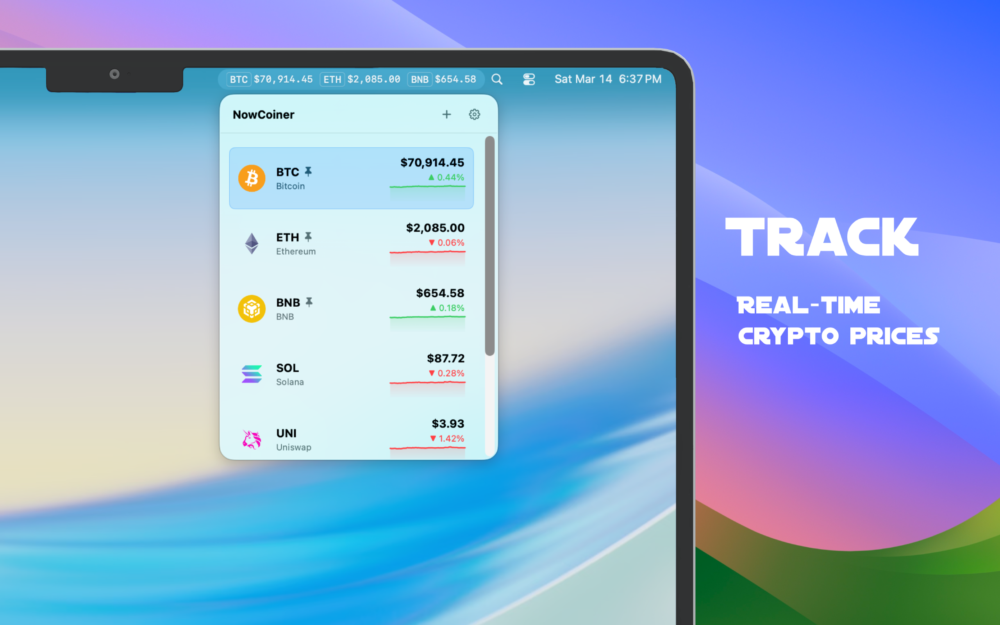
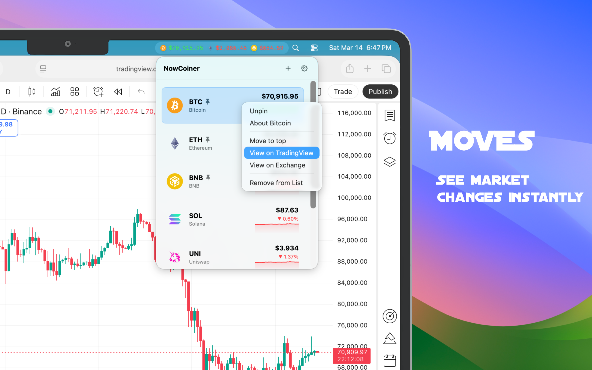
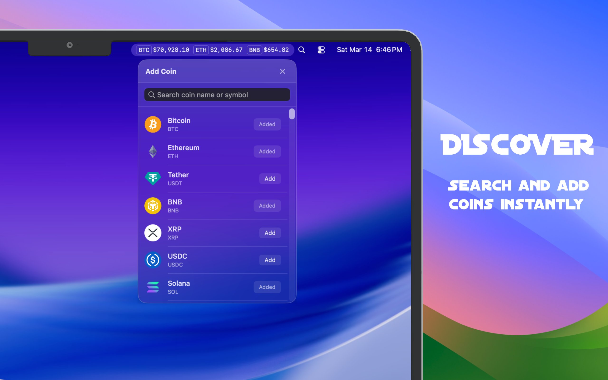
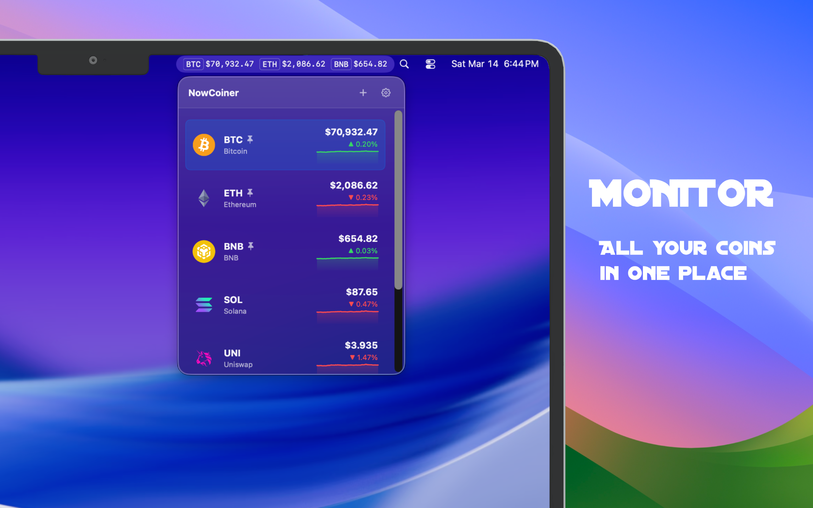
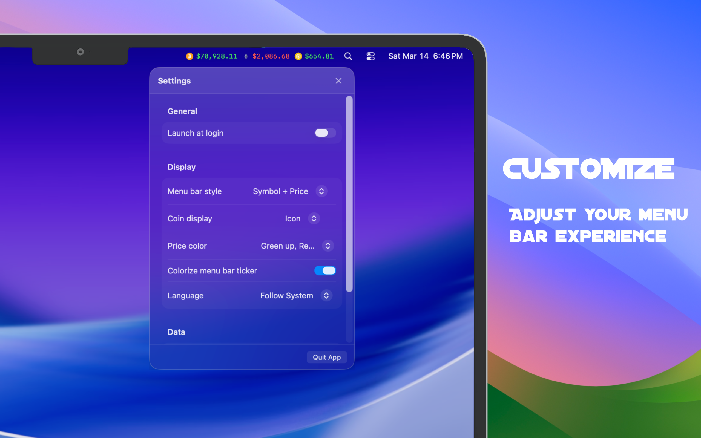

<p align="center">
  
</p>

<h1 align="center">NowCoiner</h1>

<p align="center">
  A lightweight macOS menu bar app for tracking cryptocurrency prices in real time.
</p>

<p align="center">
  
  
  
</p>

<p align="center">
  <a href="https://now-coiner.gulu.ai">Homepage</a> ·
  <a href="https://apps.apple.com/us/app/nowcoiner/id6759320009">App Store</a> ·
  <a href="https://github.com/mylxsw/NowCoiner/releases">Releases</a>
</p>

## Screenshots

<p align="center">
  
  
</p>

<p align="center">
  
  
</p>

<p align="center">
  
</p>

## Features

**Menu Bar Ticker**
- Display pinned coin prices directly in the macOS menu bar
- Multiple display styles: price only, symbol + price, symbol + change, or full
- Text or icon display mode with optional price coloring

**Real-Time Updates**
- Sub-second price updates via Binance WebSocket (`miniTicker` stream)
- Automatic reconnection with exponential backoff
- CoinGecko REST polling for supplementary market data (24h change, market cap)
- Sparkline data refreshed every 5 minutes

**Watchlist Management**
- Add coins from a searchable catalog (CoinGecko-sourced)
- Drag-to-reorder, pin/unpin (up to 3), move to top, remove
- Keyboard navigation: arrow keys to browse, Return to open detail, Delete to remove

**Coin Detail View**
- 7-day sparkline chart (Swift Charts)
- Market data: market cap, rank, 24h volume, high/low
- Links to website, whitepaper, Reddit, GitHub
- Developer stats: stars, forks, recent commits
- 10-minute local cache with TTL

**Customizable Settings**
- Launch at login
- Global shortcut (default `⌘⇧C`) to summon a floating panel
- Quote currency selection
- Appearance: light / dark / system
- Price color scheme: green-up-red-down or inverted
- Refresh interval: realtime, 10s, 30s, 1m, 5m
- Default exchange: Binance, Coinbase, OKX

**Other**
- Context menu with quick links to TradingView and exchange pages
- Bilingual UI: English and Simplified Chinese
- Zero external dependencies — pure Swift / SwiftUI / AppKit
- Runs as an LSUIElement (menu bar only, no Dock icon)

## Requirements

- macOS 14.0 (Sonoma) or later
- Swift 6.2+ toolchain (Xcode 26 or matching swift.org toolchain)

## Installation

### Build from Source

```bash
git clone https://github.com/mylxsw/NowCoiner.git
cd NowCoiner
swift build -c release
```

The built binary is at `.build/release/NowCoinerApp`. To create a distributable `.app` bundle:

```bash
./scripts/package_app.sh
```

### Install

You can install NowCoiner from the [Mac App Store](https://apps.apple.com/us/app/nowcoiner/id6759320009) for a direct, supported distribution. If you prefer not to use the App Store, build the app yourself from source using the steps above.

## Usage

Launch NowCoiner and it appears as a ticker in your menu bar — no Dock icon, no main window. Click the ticker to open the watchlist panel.

| Action | How |
|---|---|
| Open watchlist | Click the menu bar ticker |
| Search & add coins | Click the search icon in the panel |
| Open settings | Click the gear icon in the panel |
| Summon floating panel | Press `⌘⇧C` (configurable) |
| Navigate list | `↑` / `↓` arrow keys |
| Open coin detail | `Return` |
| Remove coin | `Delete` or right-click → Remove |
| Reorder coins | Drag and drop |

## FAQ

### Is NowCoiner open source and free?

Yes. NowCoiner is open source, and you can build and use it yourself at no cost. If you want to support ongoing development, the App Store version is the same app and costs about the price of a cup of coffee.

### How do I install NowCoiner?

There are two supported paths: build it yourself from source, or install it from the [Mac App Store](https://apps.apple.com/us/app/nowcoiner/id6759320009).

### Is it resource-heavy?

No. NowCoiner is built natively in Swift and keeps updates lightweight. Actual usage depends on how many coins you pin and which refresh settings you choose.

## Configuration

All settings are persisted as JSON under:

```
~/Library/Application Support/NowCoiner/
├── settings.json
├── watchlist.json
└── cache/
    ├── coins_list.json
    ├── prices.json
    ├── sparklines.json
    └── details.json
```

### Environment Variables

| Variable | Required | Description |
|---|---|---|
| `COINGECKO_API_KEY` | No | Sent as `x-cg-demo-api-key` header on CoinGecko requests. Useful if you hit rate limits. |

## Architecture

NowCoiner is a two-target Swift Package (no Xcode project file):

```
Sources/
├── NowCoinerCore/          # Library — all testable logic
│   ├── Models/             # Coin, CoinDetail, AppSettings
│   ├── Services/           # CoinGecko, Binance, WebSocket
│   ├── Storage/            # JSON file persistence
│   ├── Utils/              # Formatting, search, URL building
│   └── ViewModels/         # TickerViewModel, SearchViewModel
└── NowCoinerApp/           # Executable — UI layer
    ├── Views/              # SwiftUI views
    ├── Support/            # AppKit integration, panels, shortcuts
    └── Resources/          # App icon, localization strings
```

The app follows MVVM with protocol-driven services:

```
Views (SwiftUI)
  └─ TickerViewModel (@MainActor, ObservableObject)
       ├─ CoinGeckoServicing  → REST API client
       ├─ BinanceServicing    → REST API client
       ├─ WebSocketManaging   → Real-time price stream
       └─ Storage             → SettingsStore / WatchlistStore / CoinCacheStore
```

All service dependencies are defined as protocols, making them easy to mock in tests. `AppContainer` wires everything together at launch.

### Data Flow

1. **Binance WebSocket** pushes `miniTicker` events → `TickerViewModel` applies ticks in real time
2. **CoinGecko polling** (every 60s) supplements 24h change and market cap
3. **Sparkline refresh** (every 5 min) updates 7-day chart data
4. WebSocket auto-reconnects with exponential backoff; system wake triggers immediate reconnection

## Development

```bash
# Build
swift build

# Run
swift run NowCoinerApp

# Test
swift test

# Run a specific test suite
swift test --filter PriceFormatterTests
```

### Testing

Tests live in `NowCoinerCoreTests` and cover:

- Price formatting (`PriceFormatterTests`)
- Exchange URL generation (`ExchangeURLBuilderTests`)
- Search filtering (`SearchFilterTests`)
- Exponential backoff logic (`ExponentialBackoffTests`)
- JSON persistence (`JSONFileStoreTests`)
- ViewModel state management (`TickerViewModelTests`)
- Real-time tick processing (`TickerRealtimeTests`)
- WebSocket message parsing (`WebSocketMessageParserTests`)
- Detail cache TTL (`TickerDetailCacheTests`)

Each test creates mock services and temporary file-backed stores — no network calls, no side effects.

## Contributing

Contributions are welcome! Please open an issue first to discuss what you'd like to change.

1. Fork the repository
2. Create your feature branch (`git checkout -b feature/amazing-feature`)
3. Commit your changes (`git commit -m 'Add amazing feature'`)
4. Push to the branch (`git push origin feature/amazing-feature`)
5. Open a Pull Request

## License

This project is licensed under the GNU Affero General Public License v3.0 or later. That means people can use, modify, compile, and redistribute NowCoiner, including in derivative products, but any distributed modified version must also remain open source under the same license terms.

See [LICENSE](LICENSE) for the full text.

## Acknowledgments

- [CoinGecko API](https://www.coingecko.com/en/api) — coin metadata and market data
- [Binance WebSocket API](https://binance-docs.github.io/apidocs/spot/en/) — real-time price streaming
